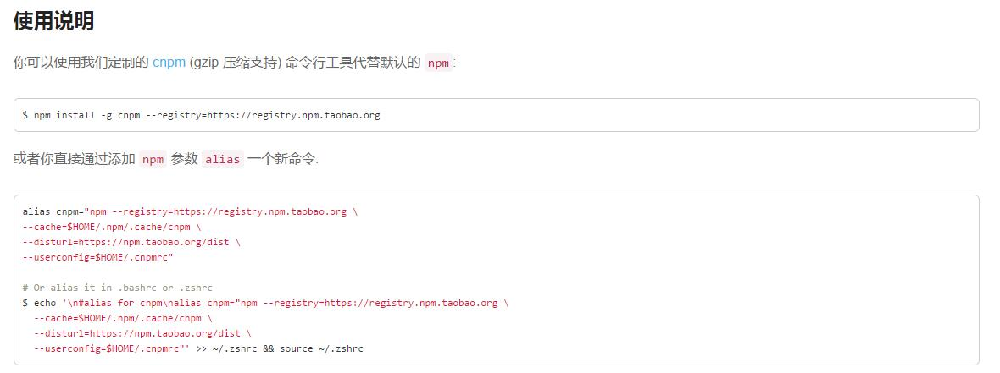
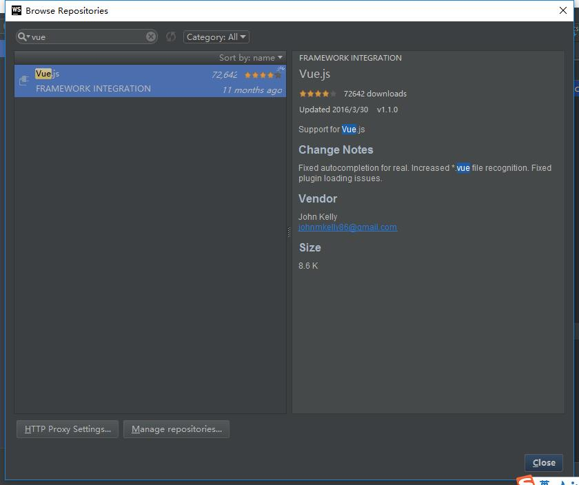
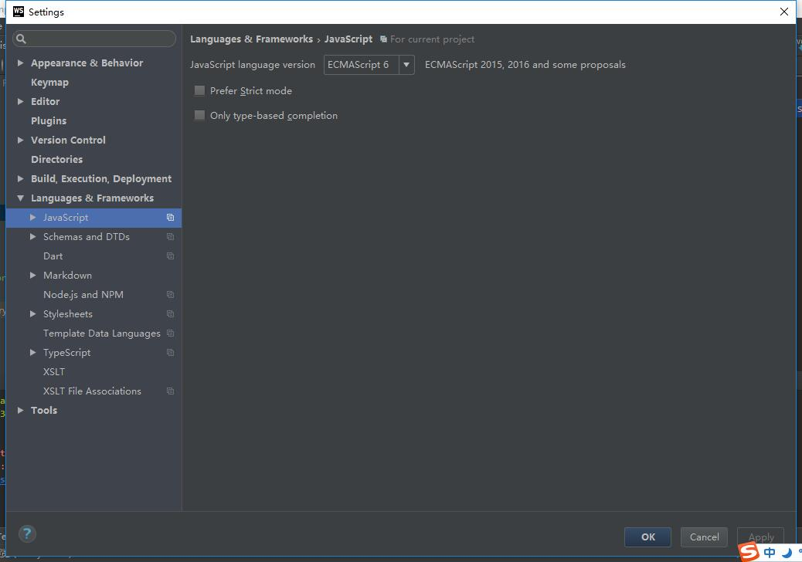

[TOC]


# vue 快速入门


## 什么是Vue

Vue.js（读音 /vjuː/，类似于 **view**） 是一套构建用户界面的**渐进式框架**。与其他重量级框架不同的是，Vue 采用自底向上增量开发的设计。Vue 的核心库只关注视图层，它不仅易于上手，还便于与第三方库或既有项目整合。另一方面，当与[单文件组件](https://cn.vuejs.org/v2/guide/single-file-components.html)和 [Vue 生态系统支持的库](https://github.com/vuejs/awesome-vue#libraries--plugins)结合使用时，Vue 也完全能够为复杂的单页应用程序提供驱动。

> 什么是渐进式框架?    不做多余的事, 在需要的时候调用需要的东西


## vue 的特点


### 数据绑定

>  注：vue 提倡单向绑定，不提倡双向绑定

熟悉angular 的 ng-model 应该知道是双向绑定的但 vue 的 v-model 实际上是单向数据流的语法糖

```vue
<input type="text" v-model="something" name="" id="">
实际上是下面的语法糖
<input v-bind:value="something" v-on:input="something = $event.target.value">
```

### 组件化

组件（Component）是 Vue.js 最强大的功能之一。组件可以扩展 HTML 元素，封装可重用的代码。在较高层面上，组件是自定义元素， Vue.js 的编译器为它添加特殊功能。在有些情况下，组件也可以是原生 HTML 元素的形式，以 js 特性扩展。**几乎所有页面都可以抽象为一个组件树搭建起来**

> 对于自定义标签名，Vue.js 不强制要求遵循 [W3C规则](https://www.w3.org/TR/custom-elements/#concepts) （小写，并且包含一个短杠），尽管遵循这个规则比较好。


```vue
<div class="published-material">

  <el-card class="published-material-filter  mgb20">
    <div slot="header" class="clearfix">
      <router-link to="add">
        <el-button style="float: right;" type="primary">发布素材</el-button>
      </router-link>
    </div>
    <material-select :searchLabel="searchLabel" @change="selectChange"></material-select>
  </el-card>

  <material v-for="material in materialData.list"
            :material="material"
            :edit="true"
            @delete="deletePublished"
            @labelChange="labelChange"
            type="published"></material>
  <page :data="materialData" class="text-right" @change="getData" :scroll="true" :scrollTo="300"></page>
  <label-dialog></label-dialog>
  <watermark></watermark>
</div>
```


## 运行 vue 所需要用到的运行环境

### node

[node 官网](http://nodejs.cn/)

windows 下载 msi 双击安装即可，mac 自行搜索即可，建议安装最新稳定版


#### 检测 node 是否安装完成

windows 下打开命令行工具  输入  `node -v`  正确输出即可

```
node -v
v6.2.0
```


### cnpm

> 用于快速安装 node 模块，下面所有npm 都可以替换为 cnpm 

[cnpm 官网](http://npm.taobao.org/)

建议安装方式

```
npm install -g cnpm --registry=https://registry.npm.taobao.org
```



### vue-cli

> 只用于创建项目，非必要安装

```shell
# 全局安装 vue-cli
$ npm install --global vue-cli
# 创建一个基于 webpack 模板的新项目
$ vue init webpack my-project
# 安装依赖，走你
$ cd my-project
$ npm install
$ npm run dev
```

## 例子

### helloworld
> demo/helloworld.html

### 双向绑定

> demo/双向绑定.html


## 推荐编辑器

### webstorm 

> 其他编辑器自行解决。

#### 安装 vue 高亮

setting -> plugins



#### 更换 JavaScript版本

setting -> Languages & Frameworks -> javascript 

将 版本更换为 ECMAScript6



#### vue 文件默认模板

> setting->Editor->File and Code Template-> Vue File

```vue
<template>

</template>

<script  type="text/ecmascript-6">
    export default {};
    
</script>

<style lang="scss" rel="stylesheet/scss">

</style>
```


## vue 语法

https://cn.vuejs.org/v2/guide/syntax.html


>

### 默认单页面结构

> tempalte 格式可以默认存储在 webstorm `setting->Editor->File and Code Template-> Vue File`


```vue
<template>
	<div>template 下只能存在一个元素</div>
</template>

<!-- 此处可以添加 lange 预处理语言 -->
<script  type="text/ecmascript-6">
    export default {};
    
</script>
<!-- css 使用 sass 预处理，添加 rel 避免编辑器报错 -->
<style lang="scss" rel="stylesheet/scss">

</style>
```


### hello-word

> markdown/template/hello-word

### v-on & v-bind

- v-bind [http://cn.vuejs.org/v2/api/#v-bind](http://cn.vuejs.org/v2/api/#v-bind)

  > 动态地绑定一个或多个特性，或一个组件 prop 到表达式。  可以理解为传值

  ```vue
  <!-- 绑定一个属性 -->
  

  <!-- 缩写 -->
  

  <!-- with inline string concatenation -->
  

  <!-- class 绑定 -->
  <div :class="{ red: isRed }"></div>
  <div :class="[classA, classB]"></div>
  <div :class="[classA, { classB: isB, classC: isC }]">

  <!-- style 绑定 -->
  <div :style="{ fontSize: size + 'px' }"></div>
  <div :style="[styleObjectA, styleObjectB]"></div>

  <!-- 绑定一个有属性的对象 -->
  <div v-bind="{ id: someProp, 'other-attr': otherProp }"></div>

  <!-- 通过 prop 修饰符绑定 DOM 属性 -->
  <div v-bind:text-content.prop="text"></div>

  <!-- prop 绑定. “prop” 必须在 my-component 中声明。 -->
  <my-component :prop="someThing"></my-component>

  <!-- XLink -->
  <svg><a :xlink:special="foo"></a></svg>
  ```

- v-on [http://cn.vuejs.org/v2/api/#v-on](http://cn.vuejs.org/v2/api/#v-on)

  > 用在普通元素上时，只能监听 **原生 DOM 事件**。用在自定义元素组件上时，也可以监听子组件触发的**自定义事件**。

  ```vue
  <!-- 方法处理器 -->
  <button v-on:click="doThis"></button>
  <!-- 内联语句 -->
  <button v-on:click="doThat('hello', $event)"></button>
  <!-- 缩写 -->
  <button @click="doThis"></button>
  <!-- 停止冒泡 -->
  <button @click.stop="doThis"></button>
  <!-- 阻止默认行为 -->
  <button @click.prevent="doThis"></button>
  <!-- 阻止默认行为，没有表达式 -->
  <form @submit.prevent></form>
  <!--  串联修饰符 -->
  <button @click.stop.prevent="doThis"></button>
  <!-- 键修饰符，键别名 -->
  <input @keyup.enter="onEnter">
  <!-- 键修饰符，键代码 -->
  <input @keyup.13="onEnter">
  ```

  ​


### vue 各种方法

> 建议前往官网查看 链接[vueJs](http://cn.vueJs.org)


#### 单页组件

> 点击[这里](https://cn.vuejs.org/v2/guide/single-file-components.html)查看官方文档

在很多Vue项目中，我们使用 `Vue.component` 来定义全局组件，紧接着用 `new Vue({ el: '#container '})` 在每个页面内指定一个容器元素。

这种方式在很多中小规模的项目中运作的很好，在这些项目里 JavaScript 只被用来加强特定的视图。但当在更复杂的项目中，或者你的前端完全由 JavaScript 驱动的时候，下面这些缺点将变得非常明显：

- **全局定义(Global definitions)** 强制要求每个 component 中的命名不得重复
- **字符串模板(String templates)** 缺乏语法高亮，在 HTML 有多行的时候，需要用到丑陋的 `\`
- **不支持CSS(No CSS support)** 意味着当 HTML 和 JavaScript 组件化时，CSS 明显被遗漏
- **没有构建步骤(No build step)** 限制只能使用 HTML 和 ES5 JavaScript, 而不能使用预处理器，如 Pug (formerly Jade) 和 Babel

文件扩展名为 `.vue` 的 **single-file components(单文件组件)** 为以上所有问题提供了解决方法，并且还可以使用 Webpack 或 Browserify 等构建工具。

这是一个文件名为 `Hello.vue` 的简单实例：


现在我们获得：

- [完整语法高亮](https://github.com/vuejs/awesome-vue#syntax-highlighting)
- [CommonJS 模块](https://webpack.github.io/docs/commonjs.html)
- [组件化的 CSS](https://github.com/vuejs/vue-loader/blob/master/docs/en/features/scoped-css.md)

#### data

> 绑定数据，在methods 中使用只能通过 this.name 来访问

**data 必须是一个 function 并且 return json 出来**

```vue
<template>
	<div>{{test}}</div>
</template>

<script>
    export default {
      data() {
        return {
          test: 123
        }
      }
    };
    
</script>

<style lang="scss" rel="stylesheet/scss">

</style>
```

#### methods

> 方法

```vue
<template>
	<div><button v-on:click="methodName"></button></div>
</template>

<script>
    export default {
      methods: {
        methodName() {
          console.log('method running..')
        }
      }
    };
    
</script>

<style lang="scss" rel="stylesheet/scss">

</style>
```

#### computed

> 计算属性 [详细介绍](http://cn.vuejs.org/v2/api/#computed)

```vue
<template>
	<div><button v-on:click="methodName"></button></div>
</template>

<script>
    export default {
      data: { a: 1 },
      computed: {
        // 仅读取，值只须为函数
        aDouble: function () {
          return this.a * 2
        }
      }
    };
    
</script>

<style lang="scss" rel="stylesheet/scss">

</style>
```

#### watch

```vue
<template>
	<div><button v-on:click="methodName"></button></div>
</template>

<script>
data: {
    a: 1,
    b: 2,
    c: 3
  },
  watch: {
    a: function (val, oldVal) {
      console.log('new: %s, old: %s', val, oldVal)
    },
    // 方法名
    b: 'someMethod',
    // 深度 watcher
    c: {
      handler: function (val, oldVal) { /* ... */ },
      deep: true
    }
  }
</script>

<style lang="scss" rel="stylesheet/scss">

</style>
```


#### props

> 用于接收来自父组件的数据

```vue
<!-- components/componentName -->
<template>
	<button @click="handleClick">{{componentId}} + {{number}}</button>
</template>

<script>
	export default {
      props: {
        number: {
          type: Number,
          default: 0
        },
        componentId: {
          type: String,
          default: '',
          required: true
        }
      },
      methods: {
        handleClick() {
          // 触发自定义事件
          this.$emit('click');
        }
      }
	}
    
</script>

<style lang="scss" rel="stylesheet/scss">

</style>
```


#### components

> components 用于注册组件

```vue
<template>
	<div>template 下只能存在一个元素
      	<!-- 调用组件 -->
      	<components component-id="lalal" :number="213" @click="fatherClick"></components>
  	</div>
</template>

<script>
	// 引入一个 src/components 下 componentName 的文件，文件需要符合 es6 规范
	import componentName from 'components/componentName';
	
    export default {
      components: {components},
      methods: {
        fatherClick() {
          console.log('father method run');
        }
      }
    };
    
</script>

<style lang="scss" rel="stylesheet/scss">

</style>
```


其余 vue-router vuex 自行研究，太多了撸不完

vuex 点击[这里](https://segmentfault.com/a/1190000008861913)

### 创建一个组件


## 项目运行

### 项目安装

项目导出/创建后，第一件事情就是安装，建议每次更新后为避免不必要报错 cnpm install 一次

```shell
# 安装所有依赖
$ cnpm install
# 给项目安装模块
$ cnpm install --save modelName1 modelName2
# 删除模块（不删除 package.json 中保存的name）
$ cnpm uninstall modelName
# 删除模块，同时删除 package.json 中保存的 name 
$ cnpm uninstall --save modelName
```

#### 启动时报错

1. 如果是 安装模块后报错，建议删除模块后重新安装
2. 启动项目是报错`Module not found: Error: Cannot resolve module 'xxx' in F:\wamp64\www\xxx` 是更新后没有安装模块，运行`cnpm install` 并且重启项目
3. `Error: listen EADDRINUSE :::xxxx`  端口占用, 更改`config/index.js:21`  `port `  选项


### 项目运行

#### dev  开发环境

```shell
$ npm run dev
```

> 扩展：在dev环境时 全局 process.env.NODE_ENV 为 `config/dev.env.js:5` 中的值

##### 更改监听端口

`config/index.js:21`   `port: 8085,`  更改即可

dev 环境下webpack 生成的文件并不会以实体存在，而是驻留在内存中

#### build 线上环境

```shell
$ npm run build
```

> 扩展：在dev环境时 全局 process.env.NODE_ENV 为 `config/prod.env.js:5` 中的值
>
> 

##### 去除build 后文件hash值

在 build 运行时会首先清空 `dist `目录下的所有文件并且生成新的带hash值的文件，这是为了防止缓存，如不喜欢可以再`build/webpack.prod.conf.js:18` 中修改

##### build 后 index 静态资源引用路径

> config/index.js:10

`assetsPublicPath: ''`更改为对应路径即可，demo:

```vue
config/index.js:10:
	assetsPublicPath: ''
dist/index
	<script type=text/javascript src=static/js/manifest.15c5e6c9ce9c68475971.js></script>
	
config/index.js:10:
	assetsPublicPath: 'http://www.baidu.com/'
dist/index
	<script type=text/javascript src=http://www.baidu.com/static/js/manifest.6ba3a6a342be0665f4af.js></script>
```


