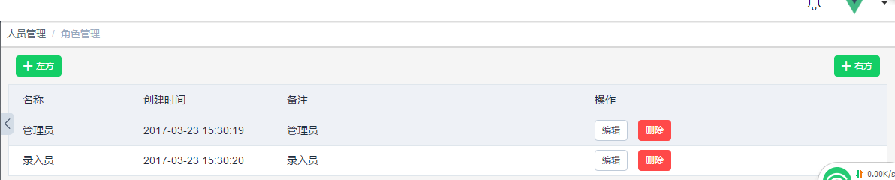

[TOC]
# 自定义组件的使用

## page 分页
### Attributes

| 参数名      | 类型                                       | 备注                     | 必填    |
| -------- | ---------------------------------------- | ---------------------- | ----- |
| data     | Object {total: 1,current_page: 1,page_size: 1} | 接收协议的page参数，可根据后端传值来返回 | false |
| scroll   | Boolean                                  | 是否分页时滚动                | false |
| scrollTo | Number                                   | 支持滚动是滚动位置(px)          | false |

### Events

| 名称     | 备注     |
| ------ | ------ |
| change | 分页发生改变 |

## limitButton 权限按钮

```javascript
/**
     * 权限按钮：
     * 基于element-ui button 组件二次封装
     * 后端返回权限格式 :
     * {
     *      "permissions":{     //拥有权限列表
     *      "goods": ["c","u"],
     *      "resourceName2": ["*"]
     * }
     *
     * “*” 代表具有所有权限 如：
     *  {
     *      permissions: {
     *          goods: '*'
     *      }
     *      // or
     *      permissions: '*'
     *  }
     * 组件传入的权限格式:      limitName::option1,option2
     *
     * props: type size icon limit
     * emit: click
     *
     */
```
### Attributes
| 参数名   | 类型     | 备注                     | 必填    |
| ----- | ------ | ---------------------- | ----- |
| limit | String | limitName::c,r,u,d      | true  |
| ...   |        | 查看element -> el-button | false |

### Evenets

| 名称    | 备注   |
| ----- | ---- |
| click | 点击   |

## authorization 权限设置

> src/components/human/authorization.vue
>
> 用于设置权限

### Attributes

| 参数名   | 类型     | 备注      | 必填    |
| ----- | ------ | ------- | ----- |
| value | String | 初始化权限回显 | false |


### Evenets

| 名称     | 备注      | 传参                 |
| ------ | ------- | ------------------ |
| change | 当权限发生改变 | auth, 接口对应格式的权限字符串 |


## optionSpace 操作区域
> src/components/common/optionSpace.vue
>
> 用于列表上方操作区域

### Slot


| 名称    | 备注   |
| ----- | ---- |
| left  | 左方按钮 |
| right | 右方按钮 |

**持续更新**

### code
```vue
<span slot="left"><el-button type="success" icon="plus" size="small">左方</el-button></span>

<span slot="right"><el-button type="success" icon="plus" size="small">右方</el-button></span>
```

### view




